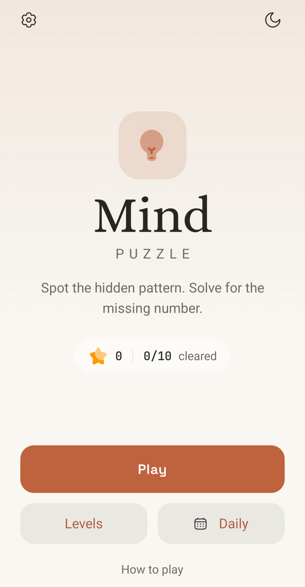
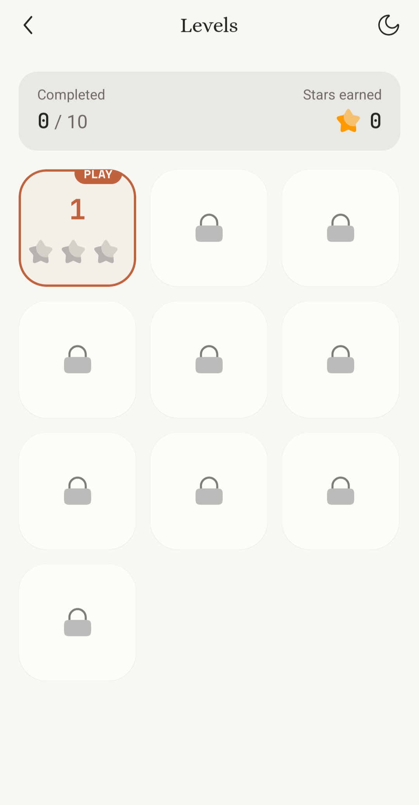
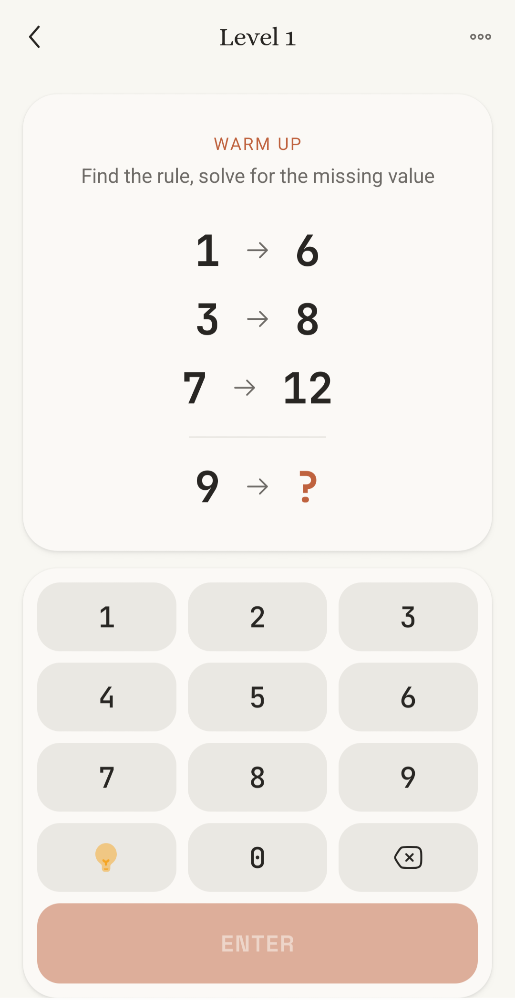
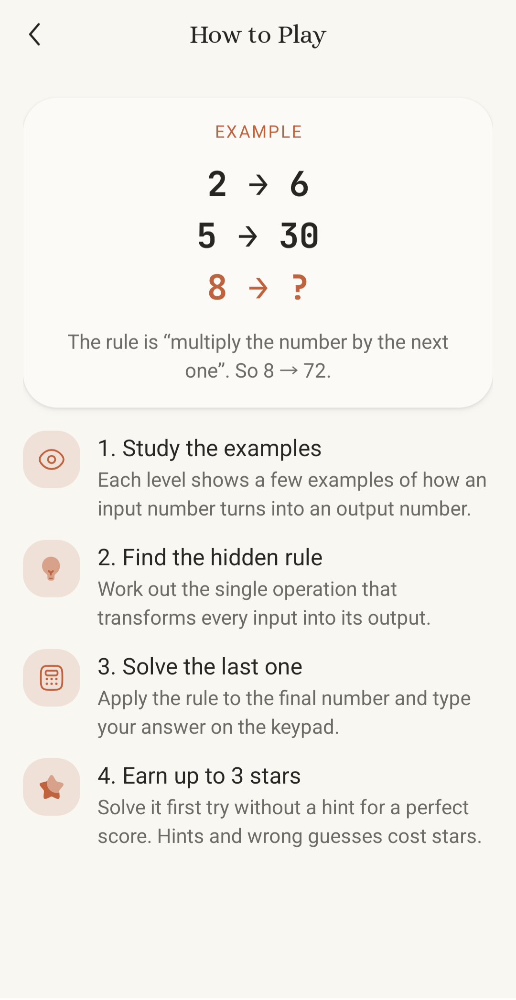
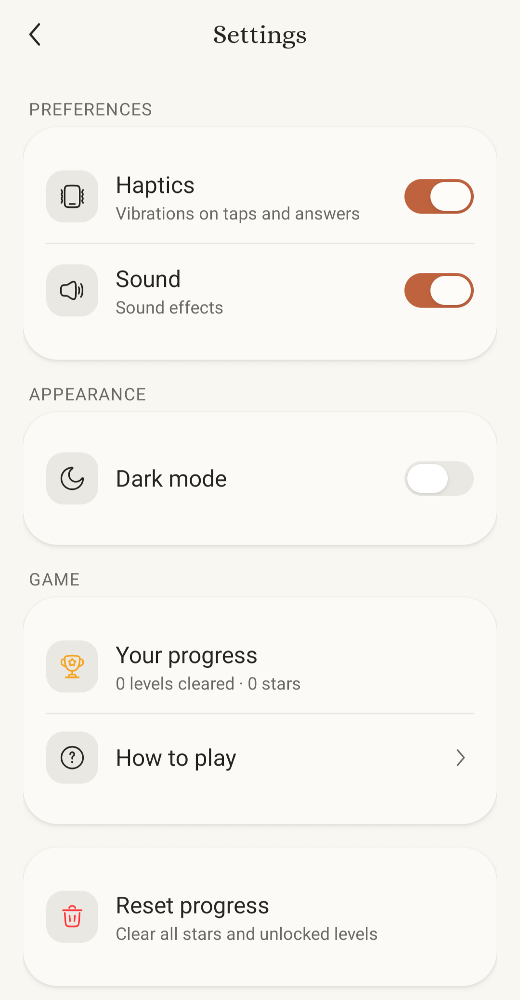
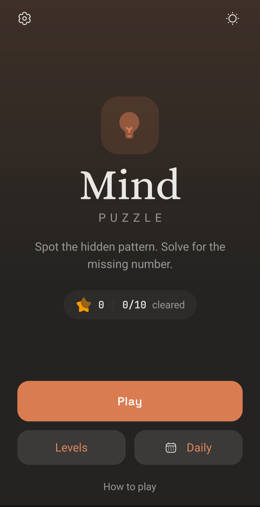
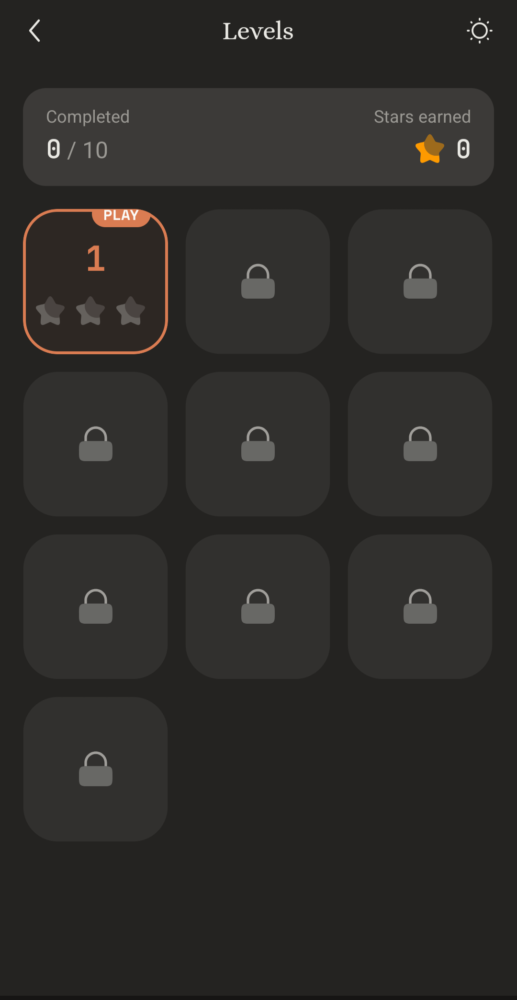
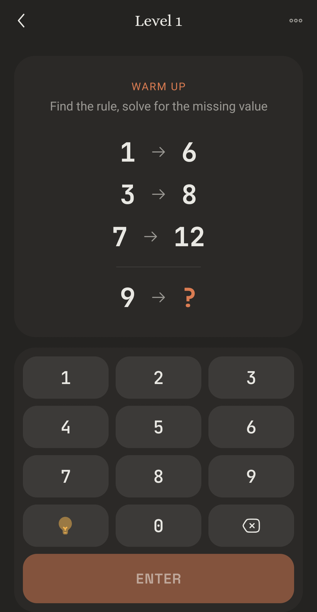
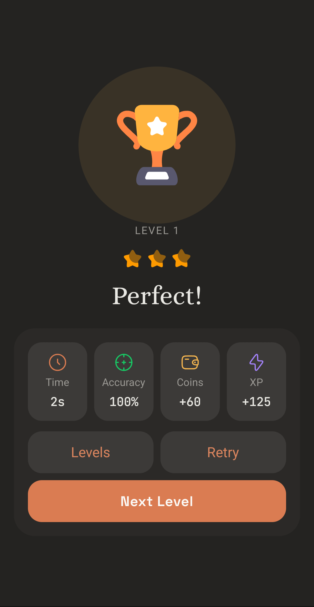
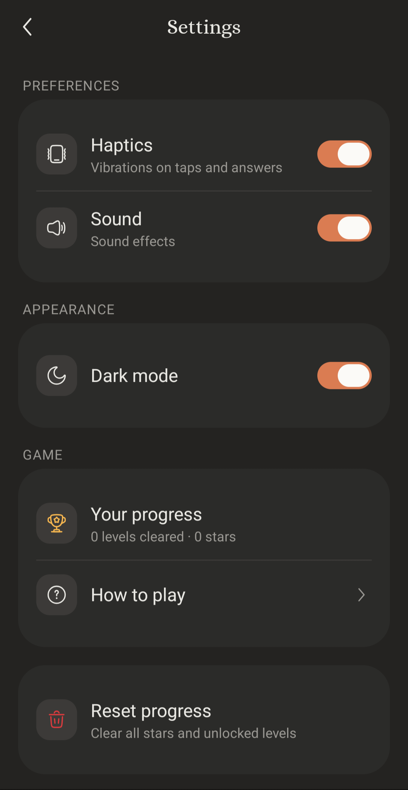

# Mind Puzzle

[](./LICENSE)
[](https://expo.dev)
[](#)

🧠 An **open-source pattern-logic brain game** built with **React Native**, **Expo** & [HeroUI Native](https://github.com/heroui-inc/heroui-native). Study the examples, spot the hidden rule, and solve for the missing number.

Open source under the [MIT License](#license) — contributions welcome.

## Screenshots

### ☀️ Light

| Home | Levels | Puzzle | How to Play | Settings |
|:---:|:---:|:---:|:---:|:---:|
|  |  |  |  |  |

### 🌙 Dark

| Home | Levels | Puzzle | Result | Settings |
|:---:|:---:|:---:|:---:|:---:|
|  |  |  |  |  |

## Features

- **Home** — daily level, progress summary (stars earned, levels cleared), and quick access to Levels / Daily / How-to-play.
- **Levels grid** — unlock progression, per-level star ratings, and the next playable level highlighted.
- **Puzzle screen** — pattern equations with a live answer, hint system, and a custom numeric keypad. Wrong answers shake; correct answers pop.
- **Result screen** — animated trophy, star rating, run stats, and confetti on a perfect score.
- **Themes** — light/dark plus extra palettes (lavender, mint, sky); progress persisted with Jotai + AsyncStorage.
- Custom fonts: Alice (headings/logo), JetBrains Mono (numbers/keypad), Space Grotesk (buttons), Inter (body).

## Get started

1. Install dependencies

   ```bash
   yarn install   # or: npm install
   ```

2. Start the app (Expo dev server)

   ```bash
   yarn start      # expo start -c
   yarn android    # open on Android
   yarn ios        # open on iOS
   ```

File-based routing with Expo Router; screens live under `src/app/(home)`.

## Project structure

```
src/
  app/(home)/            # routes: index, levels, levels/game/[level], result, settings, how-to-play
  components/            # AppHeader, icons, level tiles, rating stars, theme toggle …
  data/puzzles.ts        # the hand-authored puzzles + star scoring
  store/                 # Jotai atoms + hooks (progress, settings)
  contexts/              # app theme provider
scripts/gen-icons.mjs    # generates app icon / splash assets
```

> **Header note:** Android edge-to-edge double-counts the status-bar inset on the native stack header, so screens use a custom `src/components/views/app-header.tsx` that applies the top inset once.

## App icon & splash

Icons are **code-generated** (don't edit the PNGs by hand). Edit `scripts/gen-icons.mjs`, then:

```bash
node scripts/gen-icons.mjs
```

Current design: flat cream (`#F4F1EA`) background with a dark-brown (`#382110`) lightbulb. Outputs `icon`, adaptive `background`/`foreground`/`monochrome`, and `splash-icon` into `assets/images/`. After changing icons, re-run `expo prebuild` and rebuild.

## Building a release APK (local, no EAS)

Managed Expo SDK 56 app. To build an installable Android APK locally:

```bash
export JAVA_HOME=$(/usr/libexec/java_home -v 17)        # JDK 17 (not 23)
npx expo prebuild --platform android --no-install        # sync name/icon → native
cd android
./gradlew assembleRelease \
  -PreactNativeArchitectures=arm64-v8a \                 # arm64-only ⇒ ~half size
  -x lintVitalRelease -x lintVitalAnalyzeRelease         # skip lint (avoids OOM)
```

Output: `android/app/build/outputs/apk/release/app-release.apk` (~53 MB, debug-keystore signed — fine for sideloading, **not** for the Play Store).

`android/gradle.properties` is configured with a higher JVM heap/metaspace (KSP + lint otherwise hit `Metaspace` OOM) and R8 minification + resource shrinking (`android.enableMinifyInReleaseBuilds`, `android.enableShrinkResourcesInReleaseBuilds`).

Install over Wireless ADB:

```bash
adb pair <phone-ip:pair-port> <pairing-code>   # Developer options → Wireless debugging
adb connect <phone-ip:connect-port>
adb install -r android/app/build/outputs/apk/release/app-release.apk
```

## Tech

- Expo Router · React Native (New Architecture, Hermes)
- HeroUI Native (Uniwind / Tailwind for React Native)
- Jotai + AsyncStorage (persisted progress/settings)
- React Native Reanimated · Lottie · react-native-keyboard-controller

## Contributing

Contributions are welcome! To get started:

1. Fork the repo and create a branch: `git checkout -b feat/my-change`.
2. Run `yarn install`, make your change, and `yarn lint`.
3. Add new puzzles in `src/data/puzzles.ts`, or improve a screen under `src/app/(home)`.
4. Open a pull request describing the change.

Please keep changes focused and match the existing code style.

## License

Released under the [MIT License](./LICENSE) — © 2026 simpleneeraj. You're free to use, modify, and distribute it; attribution appreciated.

## Acknowledgements

- Bootstrapped from the [HeroUI Native](https://github.com/heroui-inc/heroui-native) example app.
- Icons from [Solar Icons](https://www.npmjs.com/package/@solar-icons/react-native); fonts via [@expo-google-fonts](https://github.com/expo/google-fonts) (Alice, Inter, Space Grotesk, JetBrains Mono).
- Built with [Expo](https://expo.dev) and [React Native](https://reactnative.dev).
